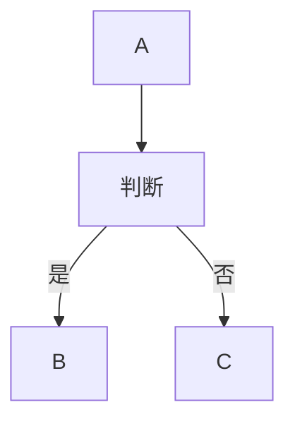

# MarkDown的语法 {ignore = tuue}
[TOC]

---
## 0.设置插件 [^0]
[^0]:https://shd101wyy.github.io/markdown-preview-enhanced/#/zh-cn/

运行 `Open User Settings` 命令，然后搜索`markdown-preview-enhanced`。

---
## 1. 标题
使用\# 标记标题，共六级。
\# 最大 \###### 最小
```MarkDown
# H1标题
###### H6标题
```  
**示例:**
# H1标题 {ignore = true}
###### H6标题 {ignore = true}

>[!tip] 特性
>添加 id 或者 class，在标题最后添加 {#id .class1 .class2}。
>示例:
>```MarkDown
># 这个标题拥有 1 个 id {#my_id}
># 这个标题有 2 个 classes {.class1 .class2}
>```

---
## 2. 强调

```MarkDown
*斜体*  
_斜体_
**粗体**
__粗体__
***粗斜体***
___粗斜体___
_**结合**使用_
*__结合__使用* 此种组合无效
~~删除线~~
==高亮==
```
**示例:**
*斜体*  
_斜体_
**粗体**
__粗体__
***粗斜体***
___粗斜体___
_**结合**使用_
*__结合__使用* 
~~删除线~~
==高亮==
>[!tip] 特性
>使用`==text==`高亮内容为特性

---
## 3. 列表  
列表嵌套应统一使用**TAB**或**两次空格**
### 3.1 无序列表  

```
- Item 1
- Item 2
  - Item 2A
  - Item 2B
     - Item 2Ba
```

**示例:**
- Item 1
- Item 2
   - Item 2A
   - Item 2B
     - Item 2Ba
### 3.2 有序列表  
代码中只需使用`1. `即可自动排序
```MarkDown
1. Item 1
1. Item 2
1. Item 3
   1. Item 3A
   1. Item 3B
        1. Item 3Ba
```
**示例:**
1. Item 1
1. Item 2
1. Item 3
    1. Item 3A
    1. Item 3B
       1. Item 3Ba
---
## 4. 链接
```MarkDown
https://github.com - 自动生成！
[GitHub](https://github.com)
```
**示例:**
https://github.com
[GitHub](https://github.com)

---
## 5. 添加图片
```MarkDown

Format: 
<!-- 也可用以下方式添加图片 -->
@impoat "/imgs/a.png"
![[/imgs/a.png]]
```
**示例:**

Format: 
@import "/imgs/a.png"
![[/imgs/a.png]]

>[!tip] 特性
>注释下两种方法为特性

---

## 6. 引用
```MarkDown
正如 Kanye West 所说：
> We're living the future so
> the present is our past.

> [!NOTE]
> This is a note blockquote.

> [!WARNING]
> This is a warning blockquote.
```

### 示例：{ignore = true}
正如 Kanye West 所说：
> We're living the future so
> the present is our past.

> [!NOTE] Note-Test
> This is a note blockquote.

> [!WARNING]
> This is a warning blockquote.
---
## 7. 分割线
三个或者更多的`-`、`*`、`_`。
```MarkDown
---
text

***
text

___
```

**示例:**

---
text
***
text
___

## 8. 代码
### 8.1 行内代码
```MarkDown
我觉得你应该在这里使用
`<addr>` 才对。
```
**示例:**
我觉得你应该在这里使用`<addr>` 才对。

### 8.2 代码块
你在代码上面和下面添加` ``` `来表示代码块。
### 8.3 其他
在上面的` ``` `后添加语言名称以添加语法高亮
**示例:**  
给 ruby 代码添加语法高亮
```
```ruby
require 'redcarpet'
markdown = Redcarpet.new("Hello World!")
puts markdown.to_html

```
```
会得到下面的效果：
```ruby
require 'redcarpet'
markdown = Redcarpet.new("Hello World!")
puts markdown.to_html
```

>[!tip] 特性:在语言名称后添加{.class1 .class .line-numbers highlight=[1-10,15,20-22]}以设置代码块class、显示行数与高亮代码。

**示例:**
```MarkDown
```javascript{.class1 .class .line-numbers highlight=[1-10,15,20-22]}
function add(x, y) {
  return x + y
}
```
```
**结果:**  
```javascript{.class1 .class .line-numbers highlight=1}
function add(x, y) {
  return x + y
}
```
---

## 9. 任务列表
```MarkDown
- [x] @mentions, #refs, [links](), **formatting**, and <del>tags</del> supported
- [x] list syntax required (any unordered or ordered list supported)
- [x] this is a complete item
- [ ] this is an incomplete item

```
**示例:**
- [x] @mentions, #refs, [links](), **formatting**, and <del>tags</del> supported
- [x] list syntax required (any unordered or ordered list supported)
- [x] this is a complete item
- [ ] this is an incomplete item

---
## 10. 表格
```markdown
表头1|表头2|表头3
:-----|:-----:|-----:
单元格1|单元格2|单元格3
单元格4|单元格5|^
单元格6||

```
**示例:**
表头1|表头2|表头3
:-----|:-----:|-----:
单元格1|单元格2|单元格3
单元格4|单元格5|^
单元格6||

---
## 11. Emoji & Font-Awesome
```markdown
:smile:
:fa-car:
```
**示例:**
:smile:
:fa-car:

---

## 12. 角标
### 12.1 上标
```markdown
30^th^
你^TM^
```
**示例:**
30^th^
你^TM^

### 12.2 下标
```markdown
H~2~O
```
**示例:**
H~2~O ^my-block

---
## 13. 脚注 
```markdown
text [^1]
```
**示例:**
text [^1]

[^1]: Hi! This is a footnote

---
## 14. 缩略
```markdown
*[HTML]: Hyper Text Markup Language
*[W3C]: World Wide Web Consortium
The HTML specification
is maintained by the W3C.
```
**示例:**
*[HTML]: Hyper Text Markup Language
*[W3C]: World Wide Web Consortium
The HTML specification
is maintained by the W3C.

---
## 15. CriticMarkup
基本语法：
```
添加 {++ ++}
删除 {-- --}
替换 {~~ ~> ~~}
```
**示例:**
 {++添加++}
 {--删除--}
 {~~old ~>new ~~}

---
## 16. Admonition [^2]
```markdown
!!! note 标题
    内容
```

**示例:** 


!!! note 标题
    内容

[^2]: https://squidfunk.github.io/mkdocs-material/reference/admonitions/#inline-blocks-inline-end

---

## 17. 块引用
在段落或列表项末尾追加 ^block-id，把它标记为可被引用的块：
```markdown
这一段可以被引用。 ^my-block
- 列表项也可以。 ^another-block
```
之后可以在工作区任意位置引用它：
```markdown
参见 [[Note^my-block]]，或者直接嵌入：![[Note^my-block]]
```
命令 `Markdown Preview Enhanced: Copy Block Reference`（命令面板）会为光标所在段落生成（或复用已有的）^id，并把可直接粘贴使用的 `[[Note#^id]]` 链接复制到剪贴板。


---

## 18. 笔记嵌入
带 ! 前缀的写法会将目标内容直接嵌入到当前位置：
```markdown {.line-numbers}
![[Note]]                      <!-- 嵌入整篇笔记 -->
![[Note#Heading]]              <!-- 仅嵌入对应的标题小节 -->
![[Note^block-id]]             <!-- 仅嵌入对应的块 -->
![[Note|要显示的标题]]         <!-- 嵌入并自定义显示标题 -->
![[image.png]]                 <!-- 普通图片嵌入（支持各种图片扩展名） -->
```

**2:**
![[README-about-MarkDown.md#1. 标题]]              <!-- 仅嵌入对应的标题小节 -->
**3:**
![[README-about-MarkDown.md^my-block]]             <!-- 仅嵌入对应的块 -->
**4:**
![[/imgs/a.png]]                 <!-- 普通图片嵌入（支持各种图片扩展名） -->#impoatant


递归层级上限为 3 层——即使形成嵌入循环也不会撑爆预览。

---
## 19. Wiki 链接（Wikilinks）

```markdown
[[Note]]                       <!-- 链接到 Note（默认解析为 Note.md） -->
[[Note|显示文本]]              <!-- 自定义显示文本的链接 -->
[[Note#Heading]]               <!-- 链接到 Note 中的某个标题 -->
[[Note^block-id]]              <!-- 链接到 Note 中的某个 ^block-id -->
[[Note#Heading^block-id]]      <!-- 同时指定标题 + 块引用 -->
[[#Heading]]                   <!-- 链接到当前笔记中的标题 -->
[[^block-id]]                  <!-- 链接到当前笔记中的块 -->
```
**示例:**
**不会用！！！**
---

---
## 20. 标签（Tags）
正文中的 `#tag-name` 语法：
```
这个想法被标记为 #important 和 #project/q1。
```
通过 / 实现嵌套标签：#parent/child，可以更深（#a/b/c）。
行首仅有 # 时不会触发标签（所以 # 标题、## 标题 等正常工作）。
在预览中点击某个标签，会打开 Quick Pick 列出所有提及该标签的笔记。

---
## 21. 数学
默认下的分隔符：
```
$...$ 或者 \(...\) 中的数学表达式将会在行内显示。
$$...$$ 或者 \[...\] 或者 ```math 中的数学表达式将会在块内显示。
```

---
## 22. 图像


Mermaid [^3]
[^3]:https://mermaid-js.github.io/mermaid
```MarkDown

graph TD
A-->判断;
判断-->|是|B;
判断-->|否|C;

```




---
## 23. 目录列表（TOC）
可以通过 `ctrl-shift-p` 然后选择 `Markdown Preview Enhanced: Create Toc` 命令来创建 TOC。

可以创建多个 TOCs 。 

如果想要在 TOC 中排除一个标题，在的标题后面添加`{ignore=true} `。

也可以通过在 markdown 文件中输入 `[TOC]` 来创建 TOC。 例如：
```markdown
[TOC]

# 标题 1

## 标题 2 {ignore=true}
<!-- 标题 2 将会被目录忽略. -->
```

---

## 24. 导入外部文件
```
@import "你的文件"
```
**支持的文件类型:**
.jpeg(.jpg), .gif, .png, .apng, .svg, .bmp 文件将会直接被当作 markdown 图片被引用。
.csv 文件将会被转换成 markdown 表格。
.mermaid 将会被 mermaid 渲染。
.dot 文件将会被 viz.js (graphviz) 渲染。
.plantuml(.puml) 文件将会被 PlantUML 渲染。
.html 将会直接被引入。
.js 将会被引用为 `<script src="你的 js 文件"></script>`。
.less 和 .css 将会被引用为 style。目前 less 只支持本地文件。.css 文件将会被引用为` <link rel="stylesheet" href="你的 css 文件">`。
.pdf 文件将会被 pdf2svg 转换为 svg 然后被引用。
markdown 将会被分析处理然后被引用。
其他所有的文件都将被视为代码块。
**设置图片:**
```
@import "test.png" {width="300px" height="200px" title="图片的标题" alt="我的 alt"}

{width="300px" height="200px"}

![[ test.png ]]{width="300px" height="200px"}
```
***引用在线文件:**
```
@import "https://raw.githubusercontent.com/shd101wyy/markdown-preview-enhanced/master/LICENSE.md"
```
**强制渲染为代码块:**
```
@import "test.puml" {code_block=true class="line-numbers"}
@import "test.py" {class="line-numbers"}
```
**As（作为）代码块:**
```
@import "test.json" {as="vega-lite"}
```
**导入特定行数:**
```
@import "test.md" {line_begin=2}
@import "test.md" {line_begin=2 line_end=10}
@import "test.md" {line_end=-4}
```
**引用文件作为 Code Chunk:**
```
@import "test.py" {cmd="python3"}
```


